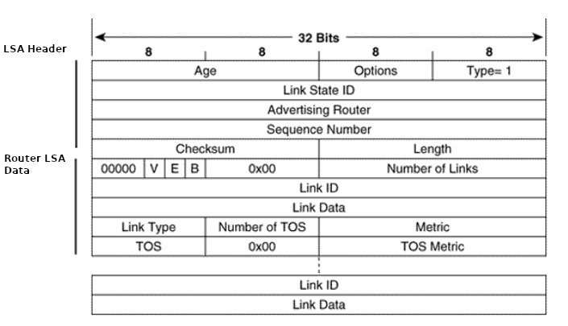

- [WTF REALLY HAPPENS](#wtf-really-happens)
- [2- WTF do I need to know?](#2--wtf-do-i-need-to-know)
- [O LAB](#o-lab)
  - [Configurações e verificações](#configurações-e-verificações)
  - [P2P e BROADCAST fecham adjacência???](#p2p-e-broadcast-fecham-adjacência)
- [The Fucking LSA](#the-fucking-lsa)
  - [The Router LSA](#the-router-lsa)
- [WTF os routers se anunciam então?](#wtf-os-routers-se-anunciam-então)
    - [Captura de pacotes](#captura-de-pacotes)
  - [Interpretation do francês Interpretacion](#interpretation-do-francês-interpretacion)

# WTF REALLY HAPPENS

**WTF really happens quando se tenta fechar adjacência entre dois roteadores vizinhos com a interface network type em point-to-point e o outro lado broadcast?**

# 2- WTF do I need to know? ##

O OSPF é um IGP *distribuído*, isto é, todos os nós participantes agem em conjunto para o protocolo funcionar, portanto, é necessário que os nós participantes do protocolo se conheçam, troquem informações entre si sobre suas interfaces e redes, saiba como operar com incidentes, atualizações na topologia e finalmente calcular o menor caminho através do algoritmo de busca de menor caminho em um GRAFO - o video ilustra como funciona -> [DJIKSTRA SPF Algorithm]¹(link de como funciona o djkstra).

> ¹Há outros algoritmos de busca em grafos, [CORMEN]() é uma boa referência para tais algoritmos.

O OSPF pode ser dividido em 3 processos

[Diagrama com os 3 processos](imagem-diagrama.png)

- **OSPF Hello Subprotocol**

  - Descoberta de vizinhos;
  - Assegura uma comunicação two-way (bidirecional) entre os dois vizinhos, isto é os pacotes de um; router alcançam o router vizinho e vice-versa. O OSPF é um IGP que trabalha com endereços de multicast e unicast;
  - Keepalive - É usado um tempo para que cada router informe aos seus vizinhos que o mesmo se encontra; ativo e operante. Caso contrário é necessário reformulação da topologia;
  - Elege o DR e BDR em redes broadcast e non-boradcast;
  - Faz a validação se os roteadores vizinhos concordam em fechar vizinhança²;
  - Utiliza o OSPF packet type - Hello Protocol

- **Database Syncronization**
  - Faz toda a troca de informação da topologia entre os roteadores do domínio
  - Envolve flooding via **IP multicast 224.0.0.5 e 226.0.0.6 para DROTHERs** ou unicast

  - Utiliza os 4 Pacotes dos 5 Pacotes totais do OSPF. 
    1. Database Descriptor Packet
    2. Link State Request Packet
    3. Link State Update Packet
    4. Link State Ack

- **Shortest Path First - DIJKSTRA Algorithm**
  - Após toda a rede tiver com os mesmos pacotes LSA's, isto é, os headers LSA forem identicos, roda-se o algoritmo de DIJKSTRA
  - Cada roteador executa o algoritmo de DIJKSTRA e calcula o menor caminho para a cada REDE anunciada em todo o domínio OSPF utilizando-se das métricas.
  - 
    
# O LAB
Fiz um laboratório bem complexo/s para descobrir isso

<small> *O funcionamento normal do protocolo determina que as rotas 172.16.10.0/24 e 172.16.20.0/24 serão aprendidas via OSPF entre R1 e R2* </small>

## Configurações e verificações
**Configuração R1 - (brodcast)**

<code>

    R1#show run | sec interface
      interface Loopback0
       ip address 1.1.1.1 255.255.255.255
       ip ospf 1 area 0
      interface GigabitEthernet0/0
       ip address 192.168.0.1 255.255.255.252
       duplex auto
       speed auto
       media-type rj45
 .
 .
 .

</code>

**Configuração R2 (point-to-point)**
<code>
    
    R2#show run | sec interface
      interface Loopback0
        ip address 2.2.2.2 255.255.255.255
        ip ospf 1 area 0
      interface GigabitEthernet0/0
        ip address 192.168.0.2 255.255.255.252
        ip ospf network point-to-point
        duplex auto
        speed auto
        media-type rj45
   .
   .
   .

</code>

**Vamos ver a tabela de vizinhança de R1**

<code>
  R1(config-router)#do show ip ospf neighbor

    Neighbor ID     Pri   State           Dead Time   Address         Interface
    2.2.2.2           0   FULL/  -        00:00:31    192.168.0.2     Ethernet0/0
</code>

**HOHOHOHO, full?**

**e a de R2?**

<code>
  R1#show ip ospf nei

Neighbor ID     Pri   State           Dead Time   Address         Interface
2.2.2.2           1   FULL/DR         00:00:31    192.168.0.2     GigabitEthernet0/0
</code>

Aqui vamos prestar atenção em alguns elementos - O campo **priority** é 1, este é um campo diretamente proporcional, isto é, a preferência maior é do valor mais alto entre as interfaces do domínio de broadcast.A interface foi eleita como <code>DR</code> pelo processo de elelição, a adjacência foi formada pelo processo de sincronização da database, isto é ambos os Routers tem a mesma tabela [Database Summary List](https://tools.ietf.org/html/rfc2328#section-10)

Então a princípio é pra haver troca de rotas pois há adjacência.

## P2P e BROADCAST fecham adjacência??? ##

**Vamos ver a tabela de rotas**
<code>

      R1#show ip route ospf
      Codes: L - local, C - connected, S - static, R - RIP, M - mobile, B - BGP
            D - EIGRP, EX - EIGRP external, O - OSPF, IA - OSPF inter area
            N1 - OSPF NSSA external type 1, N2 - OSPF NSSA external type 2
            E1 - OSPF external type 1, E2 - OSPF external type 2
            i - IS-IS, su - IS-IS summary, L1 - IS-IS level-1, L2 - IS-IS level-2
            ia - IS-IS inter area, * - candidate default, U - per-user static route
            o - ODR, P - periodic downloaded static route, H - NHRP, l - LISP
            a - application route
            + - replicated route, % - next hop override

      Gateway of last resort is not set

      R1#
</code>

<code>

      R2#show ip route ospf
      Codes: L - local, C - connected, S - static, R - RIP, M - mobile, B - BGP
            D - EIGRP, EX - EIGRP external, O - OSPF, IA - OSPF inter area
            N1 - OSPF NSSA external type 1, N2 - OSPF NSSA external type 2
            E1 - OSPF external type 1, E2 - OSPF external type 2
            i - IS-IS, su - IS-IS summary, L1 - IS-IS level-1, L2 - IS-IS level-2
            ia - IS-IS inter area, * - candidate default, U - per-user static route
            o - ODR, P - periodic downloaded static route, H - NHRP, l - LISP
            a - application route
            + - replicated route, % - next hop override

      Gateway of last resort is not set

      R2#

</code>

**E agora??**

# The Fucking LSA #

**OSPF** é um protocolo distribuído, isso quer dizer que todos os nós do domínio OSPF interagem entre si, o protocolo envolve todos os routers para seu funcionamento.

O **LSA** aka **Link State Advertisement** é a menor unidade de informação da topologia que é trocada entre os roteadores para informar ***links/redes***, esse LSA é redistribuído através de ***flooding*** **(multicast)** por todo o domínio OSPF.

> Imagine uma casa no qual é necessário transportá-la para o outro lado do país, podemos diminuir a casa em sua menor unidade, o tijolo, enviar pelo correios para onde a casa deve ser montada e lá remontá-la tijolo por tijolo, bem, o LSA é isso. Se eu tiver todos os tijolos então consigo remontar a mesma casa.

Todo **LSA** possui um cabeçalho no qual indica parâmetros importantes para distinguir entre outros LSAs geradas pelo próprio roteador e também para distinguir LSAs geradas dos outros roteadores.

<small> O header tem função de identificar cada instância de LSA, originador do LSA e a quanto tempo esse LSA existe dentro do domínio.
O campo ***Link State ID*** difere para cada TYPE de LSA, a [RFC 2328](rfc)  define 11 tipos de LSAs </small>

## The Router LSA ##

Estamos interessado no **Router LSA**.

Todo Roteador gera **Router LSAs** onde descreve as redes no qual o roteador está diretamente conectado, o tipo de rede e o custo (métrica) para chegar a esta rede.
Isto é, as informações da rede 192.168.0.0/30 estão contidas neste LSA.

O formato do Router LSA está na figurax, lembrar que todo LSA possui Header.

<small> </small>

Embora o Router-LSA tenha alguns campos, vou explicar apenas o campo ***Link type, Link ID e Link Data*** **a tabela 1**  é mais explicativa que qualquer escrita.

Cada campo Link ID e Link Data varia seu significado de acordo com o campo Link Type

Link type é basicamente o tipo de rede a qual o roteador está conectado, esta podendo ser uma rede point-to-point, transit network, stub ou um virtual link.

<small> Tabela 1 - Tipos de redes especificados para o Router-LSA</small>
| Link Type  | Link ID  | Link Data
|:---:|:---:|:---:|
|**1 - Point-to-Point**|Router ID do vizinho|IP da interface local da rede p2p|
|**2 - Connection to a transit Network**|DR IP Adress|IP da interface local da rede|
|**3 - Connection to a stub Network**|Endereço de Rede|Máscara
|**4 - virtual-link**|Router-ID do vizinho| MiB Index da interface

> Uma rede **stub** é uma rede no qual não há nenhum outro roteador conectado a ela

# WTF os routers se anunciam então? #

**R1**

<code>

    R1#show ip ospf database

                OSPF Router with ID (1.1.1.1) (Process ID 1)

        Router Link States (Area 0)

    Link ID         ADV Router      Age         Seq#       Checksum Link count
    1.1.1.1         1.1.1.1         709         0x80000072 0x00EAD0 2
    2.2.2.2         2.2.2.2         598         0x80000072 0x00FDD3 1

        Net Link States (Area 0)

    Link ID         ADV Router      Age         Seq#       Checksum
    192.168.0.2     2.2.2.2         598         0x8000006E 0x003914
    R1#

</code>

**R2**

<code>

    R2#show ip ospf database

                OSPF Router with ID (2.2.2.2) (Process ID 1)

        Router Link States (Area 0)

    Link ID         ADV Router      Age         Seq#       Checksum Link count
    1.1.1.1         1.1.1.1         908         0x80000072 0x00EAD0 2
    2.2.2.2         2.2.2.2         795         0x80000072 0x00FDD3 1

        Net Link States (Area 0)

    Link ID         ADV Router      Age         Seq#       Checksum
    192.168.0.2     2.2.2.2         795         0x8000006E 0x003914
    R2#

</code>

### Captura de pacotes ###

<small> Captura de pacotes de todo o processo OSPF.</small>

## Interpretation do francês Interpretacion